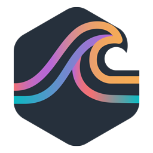
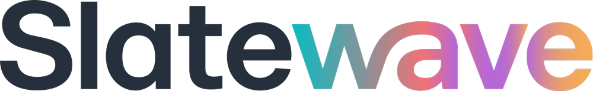

<h1 align="center">
  
  <picture>
    <source media="(prefers-color-scheme: dark)" srcset="public/brand/wordmark-light.png">
    
  </picture>
</h1>

<p align="center"><em>One palette. Every tool.</em></p>

The Slatewave site — a unified hub for the Slatewave theme family across
editors, terminals, note apps, and productivity tools. Built with Astro.

## Themes

Status legend: **beta** — shipping and installable; **planned** — not yet
available.

### Editors

- [Slatewave for VSCode](src/content/themes/vscode.mdx) — beta
- [Slatewave for Cursor](src/content/themes/cursor.mdx) — beta
- [Slatewave for VSCodium](src/content/themes/vscodium.mdx) — beta
- [Slatewave for Antigravity](src/content/themes/antigravity.mdx) — beta
- [Slatewave for JetBrains](src/content/themes/jetbrains.mdx) — beta
- [Slatewave for Xcode](src/content/themes/xcode.mdx) — beta
- [Slatewave for Sublime Text](src/content/themes/sublime-text.mdx) — beta
- [Slatewave for Zed](src/content/themes/zed.mdx) — beta
- [Slatewave for Neovim](src/content/themes/neovim.mdx) — beta
- [Slatewave for Helix](src/content/themes/helix.mdx) — beta

### Terminals

- [Slatewave for Oh My Posh](src/content/themes/oh-my-posh.mdx) — beta
- [Slatewave for Powerlevel10k](src/content/themes/powerlevel10k.mdx) — beta
- [Slatewave for Starship](src/content/themes/starship.mdx) — beta
- [Slatewave for Ghostty](src/content/themes/ghostty.mdx) — beta
- [Slatewave for iTerm2](src/content/themes/iterm2.mdx) — beta
- [Slatewave for Alacritty](src/content/themes/alacritty.mdx) — beta
- [Slatewave for WezTerm](src/content/themes/wezterm.mdx) — beta
- [Slatewave for Windows Terminal](src/content/themes/windows-terminal.mdx) — beta
- [Slatewave for Kitty](src/content/themes/kitty.mdx) — beta
- [Slatewave for bat](src/content/themes/bat.mdx) — beta
- [Slatewave for delta](src/content/themes/delta.mdx) — beta
- [Slatewave for LSD](src/content/themes/lsd.mdx) — beta
- [Slatewave for tmux](src/content/themes/tmux.mdx) — beta
- [Slatewave for btop](src/content/themes/btop.mdx) — beta

### Notes

- [Slatewave for Obsidian](src/content/themes/obsidian.mdx) — beta
- [Slatewave for Logseq](src/content/themes/logseq.mdx) — beta
- [Slatewave for MarkEdit](src/content/themes/markedit.mdx) — beta
- [Slatewave for Anytype](src/content/themes/anytype.mdx) — beta

### Productivity

- [Slatewave for Alfred](src/content/themes/alfred.mdx) — beta
- [Slatewave for Raycast](src/content/themes/raycast.mdx) — beta
- [Slatewave for Slack](src/content/themes/slack.mdx) — beta

## Develop

```sh
pnpm install
pnpm dev
```

Visit `http://localhost:4321`.

## Build

```sh
pnpm build
pnpm preview
```

## Layout

- `src/content/themes/` — one MDX file per theme (authoritative metadata)
- `src/content.config.ts` — content collection schemas
- `src/pages/themes/[slug].astro` — per-theme dynamic route
- `src/components/` — layout, theme, and UI components
- `src/styles/tokens.css` — design tokens (mirror of the Slatewave palette)

## Adding a theme

1. Create `src/content/themes/<slug>.mdx` following the schema in
   `src/content.config.ts`
2. Run `pnpm dev` — the new theme appears on `/themes/` and at
   `/themes/<slug>/` automatically
